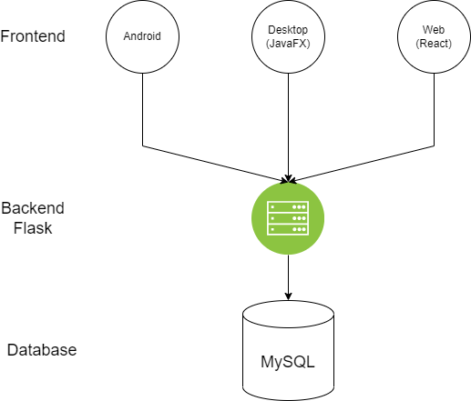

# Exchange Rate Tracker
EECE 430L Project developed for Web, Desktop and Android.
Supervised by Dr. Mohamad Chehab.
Developed by:
- Abed Karim Nasreddine
- Firas Abou Mrad
- Maarouf Yassine
- Youhanna Abou Jaoude

## Functional Documentation

These are the features supported by our platforms (Web, Desktop and Android).

### User Accounts
The app supports creating user accounts with unique usernames.

### Adding a Transaction
Logged in users can add transactions that are linked to their accounts. We also support addding anonymous transactions for non logged-in users. Adding a transaction is done by specifying the USD and LBP amounts, and the type of the transaction (USD to LBP or vice versa).

### Exchange Rates
See the USD/LBP exchange rates for buying and selling averaged over the last *3* days.

### Statistics
The statistics section displays a list of the opening and closing values of the Buy/Sell exchange rates for the past 10 days. In addition to that the statistics section contains the total amount of transactions recorded on the platform for each day in the past 10 days and the volume of these transactions in USD.

### Fluctuation Graph
A graph that plots the daily average exchange USD/LBP rates.

### Transactions Table
A table that lists all past transactions done by specific logged-in user.

### Exchange Rate Calculator
The calculator allows the user to convert a specific amount of a given currency (LBP or USD) to the other at the exchange rate shown on the main view.

### Listings 
A Page indicating all the listings that users have posted in which they request to perform a transaction and post their mobile phone numbers to be contacted by interested parties.
It also supports the functionality of adding a listing by logged-in users. 

### Architecture
Below is a simple diagram that shows that whole system architecture. Feel free to read more about every platform used in their corresponding README.md file.
	