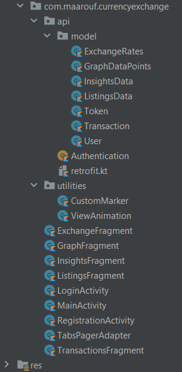

# Frontend - Android

## About
This is EECE 430L project's Android Frontend. Developed by Maarouf Yassine with the help of the instructor Mohammad Chehab and my teammates Firas Abou Mrad, Youhanna Abou Jaoude, and Abded Karim Nasreddine

## Technologies and Libraries
* The project was built using Android Studio
* Kotlin
* Retrofit 2.9.0

## Setup

### Step 1 : Backend Setup
Please refer to the corresponding backend README.md file.

### Step 2 : Run The Project
You can run the project from Android Studio.

## Functionality Delivered
1) User can sign up, login, logout, or use the platform as a guest user.

2) Check The Exchange Rate for Buying USD and Selling USD based on the transactions of last 3 days

3) Adding transactions USD -> LBP or LBP -> USD. May be done by an authenticated user or a guest user.

4) Converting a given amount of money from USD to LBP or LBP to USD. Calculation is based on the exchange rate.

5) Viewing user-specific transactions in a table.

6) Providing a platform for users to perform exchange transactions amongst each other. Users can list a transaction with their phone number to be contacted on in order to complete transaction between 2 users. Users could also see all transaction listings posted.

7) Viewing a graph that shows the fluctuation of the exchange rate over time.

8) Viewing some insights and statistics such as Open and Close Values of buy and sell rates for each day in the past 10 days. In addition to viewing the number of transactions performed every day and the volume of these transactions in Dollars.

## Project Structure

### Models
Models under the package `com.maarouf.currencyexchange.api.model` represent the responses returned from the API call to our backend, or could be used inside the bodiesa of request sent from the mobile application to the backend. The models are ExchangeRates, GraphDataPoints, InsightsData, ListingsData, Token, Transaction, and User

### API
The package `com.maarouf.currencyexchange.api` has the `retrofit.kt` file that contains all the endpoints for our android application to communicate with the backend and perform REST API calls. 
The `Authentication.kt file` is the component that takes care of userToken related functionalities, such as saving them upon user authentication or deleting them upon user logout.

### Utilities
The package `com.maarouf.currencyexchange.utilities` contain useful utilities to animate floating action button presses for example in the `ViewAnimation.kt` file, and displaying specific markers on the data points in the graph of exchange rates as per the file `CustomMarker.kt`

### Fragments
#### ExchangeFragment
It allows the user to view the average Exchange Currency Rate for the past 3 days. It also gives them the possibility to convert, using the calculator, between LBP and USD currencies. In addition to that, this module allows users to add transactions performed by them into the database.
#### GraphsFragment
It fetches the all buy and sell exchange rates that are registered and plots a graph of them.
#### InsightsFragment
It allows the user to get insights and statistics such as the buy and sell Open/Close values per day in the last 10 days. This is in addition to showing some transaction insights such as the total number of transactions in the past 10 days per day in addition to the total volume of transactions for each day in Dollars.
#### ListingsFragment
It provides a platform for users to perform exchange transactions amongst each other. This occurs by allowing authenticated users to post a listing (ie. if a user wants to sell 100$ in return of 1,500,000 LBP) with providing their phone number. Other users can see all available listings and contact the owners of a specific listing on their phones to perform the transaction.
#### TransactionsFragment
It fetches the transactions of the authenticated user, displaying them in a table.

### Activities
#### LoginActivity
Correspond to the login xml-defined component. As its name suggest, it allow an existing user to log into his/her account.
#### RegistrationActivity
Correspond to the register xml-defined component. As its names suggest, it allows a new user to register in the platform.
#### MainActivity
Serves as the controller for the navigation component, it will react to events initiated by navigation buttons and switch to the corresponding page. Thus, it will load the corresponding xml-defined components according to the option a user selects.

### Adapters
#### TabsPerPageAdapter
Acts as a panel for the user to chose which fragment they are interested in by representing the options in a Tab format.
