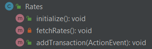

# Frontend - Desktop

## About
Developed by Abed Karim Nasreddine.

## Technologies and Libraries
* The project was built using IntelliJ IDEA
* JavaFx SDK 11.0.2
* Retrofit 2.9.0
* Java jdk-15.0.2

## Setup

### Step 1 : Backend Setup
Please refer to the corresponding backend README.md file.

### Step 2 : Run The Project
You can run the project by running the `Main.java` class under the package `com.maarouf.exchange`

## Functionality Delivered
1) User can sign up, login, logout, or use the platform as a guest user.

2) Check The Exchange Rate for Buying USD and Selling USD based on the transactions of last 3 days

3) Adding transactions USD -> LBP or LBP -> USD. May be done by an authenticated user or a guest user.

4) Converting a given amount of money from USD to LBP or LBP to USD. Calculation is based on the exchange rate.

5) Viewing user-specific transactions in a table.

6) Providing a platform for users to perform exchange transactions amongst each other. Users can list a transaction with their phone number to be contacted on in order to complete transaction between 2 users. Users could also see all transaction listings posted.

7) Viewing a graph that shows the fluctuation of the exchange rate over time.

8) Viewing some insights and statistics such as Open and Close Values of buy and sell rates for each day in the past 10 days. In addition to viewing the number of transactions performed every day and the volume of these transactions in Dollars.

## Project Structure

### Java Classes Diagram 

### Java Modules Dependency Diagram

* _Parent.java_ serves as the controller for the navigation component _parent.fxml_, it will react to events initiated by navigation buttons and switch to the corresponding page. Thus, it will load the corresponding fxml-defined components according to the option a user selects.
* _Authentication.java_ is the component that takes care of userToken related functionalities, such as saving them upon user authentication or deleting them upon user logout.
 
    
* _exchange.api package_ communicates directly with the backend via the _ExchangeService_ which makes use of the _Exchange_ interface to define the calls. The _Exchange_ Interface uses the models found in the _exchange.models package_ to shape the responses returned from the API call. The models are _ExchangeRates, GraphDataPoints, InsightsData, ListingsData, Token, Transaction, and User_
* _exchange.login_ and _exchange.register packages_ correspond to the login and register fxml-defined components. As their names suggest, they allow a new user to register to the platform, and an existing user to log into his account. Both of these components implement the _PageCompleter_ interface which will redirect the user to the "Currency Exchange" page (rates.fxml component) upon authentication.
* _exchange.rates package_ contains the rates.fxml component and the Rates.java controller. It allows the user to view the average Exchange Currency Rate for the past 3 days. It also gives him the possibility to convert, using the calculator, between LBP and USD currencies. In addition to that, this module allows users to add transactions performed by them into the database. 

    

* _exchange.transactions package_ contains the transactions.fxml component and its controller, Transactions.java. It fetches the transactions of the authenticated user, displaying them in a table.
* _exchange.graph package_ contains the graph.fxml component and its controller, Graph.java. It fetches the all buy and sell exchange rates that are registered and plots a graph of them.
* _exchange.insights package_ contains the insights.fxml component and its controller, Insights.java. It allows the user to get insights and statistics such as the buy and sell Open/Close values per day in the last 10 days. This is in addition to showing some transaction insights such as the total number of transactions in the past 10 days per day in addition to the total volume of transactions for each day in Dollars.
* _exchange.listings package_ contains the listings.fxml component and its controller, Listings.java. It provides a platform for users to perform exchange transactions amongst each other. This occurs by allowing authenticated users to post a listing (ie. if a user wants to sell 100$ in return of 1,500,000 LBP) with providing their phone number. Other users can see all available listings and contact the owners of a specific listing on their phones to perform the transaction. 

  